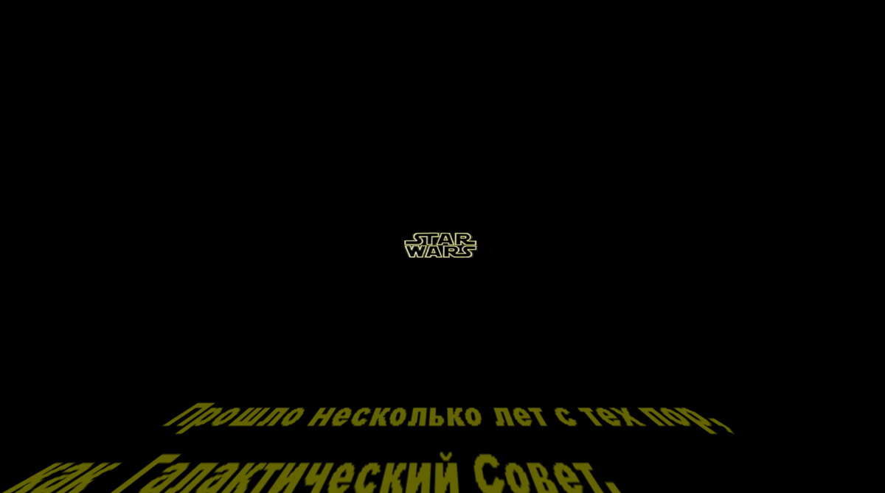

# 2003_WIN32_3D_OpenGL_game_starwars
OpenGl based game engine (flight simulator in Star Wars setting), 32-bit Windows

The game was written for the Windows platform in TMT Pascal for windows. This game engine uses Win32 API, OpenGL for graphics, DirectX for sound. To work with 3D models own libraries have been written.

*Read this in other languages: [English](README.md), [Русский](README.ru.md)

There are some screenshots if a gameplay:

# Table of contents
- [Installation](#Installation)
- [Brief description of the game](#Brief-description-of-the-game)

# Installation

To start the game, just download the starwars_game.zip file, unzip the archive and run starwars.exe, modern windows versions are supported.

To compile from sources (code folder), you must use the TMT Pascal for windows compiler

# Brief description of the game

The goal of the game is to complete flight missions. The game starts at the base, where you can talk to an NPC in a bar, try your hand at a flight simulator, or start a mission.
Management - arrow keys move, Ctrl fire from the main guns, Enter - rocket launch, Tab open the map.
